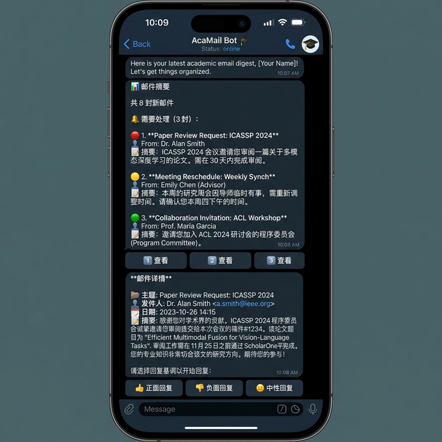
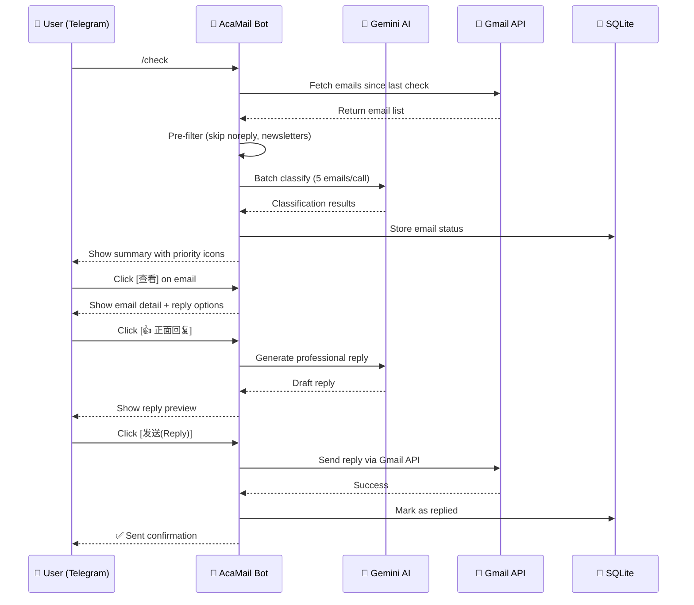
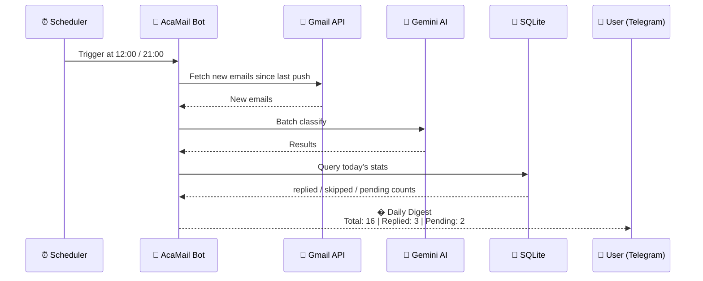

<p align="center">
  <h1 align="center">📧 AcaMail — AI Email Assistant for Academics</h1>
  <p align="center">
    <em>An intelligent Telegram bot that monitors your Gmail, classifies emails, drafts professional replies, composes new emails, and handles calendar invitations — built for professors, researchers, and academics who receive 100+ emails daily.</em>
  </p>
  <p align="center">
    <a href="#-features">Features</a> •
    <a href="#-demo">Demo</a> •
    <a href="#-architecture">Architecture</a> •
    <a href="#-quick-start">Quick Start</a> •
    <a href="#-extensibility">Extensibility</a> •
    <a href="#-comparison">vs. OpenClaw</a> •
    <a href="#-license">License</a>
  </p>
</p>

---

## ✨ Features

### 🧠 Smart Email Classification
- **AI-powered triage** — Automatically categorizes emails as actionable vs. informational
- **Batch classification** — Groups up to 5 emails per API call, saving ~60-70% token costs
- **Pre-filtering** — Pattern-based rules skip AI entirely for newsletters, notifications, and system emails
- **Priority scoring** — High / Medium / Low priority with category labels

### ✍️ Professional Reply Generation
- **3-tone drafts** — Generates positive, negative, and neutral replies in one click
- **Academic tone** — Formal language with proper greetings and sign-offs for faculty
- **Bilingual** — Chinese summaries + English replies (perfect for international academics)
- **Custom instructions** — Tell the AI (in Chinese) what to change, and it rewrites in English

### ✏️ Compose New Emails
- **AI-powered drafting** — Write email instructions in Chinese, get professional English emails
- **Contact whitelist** — Fuzzy name matching against your saved contacts
- **Subject translation** — Chinese subjects are automatically translated to English
- **Preview & confirm** — Review AI draft before sending, with regenerate option

### 📅 Calendar Invite Handling
- **Auto-detection** — Detects calendar invitations (`.ics`) in incoming emails
- **One-click response** — Accept / Decline / Tentative directly from Telegram
- **Event details** — Displays organizer, time, location, and description

### 📱 Telegram-Powered Workflow
- **Interactive inbox** — Browse, preview, and reply to emails from your phone
- **Reply / Reply All** — Choose to reply to sender only or CC all recipients
- **Compose & send** — Write new emails to anyone via `/compose` command
- **Persistent queue** — Unprocessed emails carry over between sessions
- **Daily digest** — Automatic email report at configurable times (default: 12:00 & 21:00)

### ⚡ Cost & Efficiency
- **Near-free** — Uses Google Gemini Flash Lite (free tier sufficient for most users)
- **Token-optimized** — HTML stripping, body truncation, batch classification, pre-filtering
- **Forwarded email detection** — Auto-detects forwarded emails and replies to the original sender
- **Local storage** — All data in SQLite, no cloud dependency

---

## � Demo

<p align="center">
  
</p>

<p align="center"><em>AcaMail in action: email summary → detail view → one-click reply</em></p>

### What you see in the Telegram bot:

1. **📊 Email Summary** — Prioritized list of actionable emails with Chinese summaries
2. **📋 Email Detail** — Full email with sender, date, and key content
3. **💬 Reply Options** — Choose positive / negative / neutral tone
4. **✅ Send** — Preview draft, edit if needed, then send via Reply or Reply All

---

## 🏗 Architecture

### System Overview

```
┌─────────────────────────────────────────────────────────────┐
│                      AcaMail System                         │
│                                                             │
│  ┌──────────┐   ┌──────────────┐   ┌────────────────────┐  │
│  │  Gmail    │──▶│  AI Engine   │──▶│  Telegram Bot      │  │
│  │  API      │   │  (Gemini)    │   │  (User Interface)  │  │
│  └──────────┘   └──────────────┘   └────────────────────┘  │
│       │               │                      │              │
│       │               │                      │              │
│       ▼               ▼                      ▼              │
│  ┌──────────┐   ┌──────────────┐   ┌────────────────────┐  │
│  │  OAuth2  │   │  SQLite DB   │   │  APScheduler       │  │
│  │  Auth    │   │  (Persistence│   │  (Cron Jobs)       │  │
│  └──────────┘   └──────────────┘   └────────────────────┘  │
└─────────────────────────────────────────────────────────────┘
```

### Interaction Flow



### Daily Digest Flow



### Project Structure

```
acamail/
├── main.py                 # Entry point
├── config.py               # Configuration management (.env loading)
├── contacts.json           # Contact whitelist (name → email mapping)
├── requirements.txt        # Python dependencies
├── ai/
│   ├── classifier.py       # Email classification (batch + single + pre-filter)
│   └── reply_generator.py  # Reply draft generation (3 tones + custom + compose)
├── bot/
│   ├── handlers.py         # Telegram command & callback handlers (reply, compose, calendar)
│   ├── keyboards.py        # Inline keyboard definitions
│   └── formatter.py        # Message formatting (summary, detail, digest)
├── gmail/
│   ├── auth.py             # OAuth2 authentication
│   ├── client.py           # Gmail API client (fetch, send, reply-all, compose, calendar)
│   └── models.py           # Data models (Email, CalendarInvite, etc.)
├── scheduler/
│   └── jobs.py             # Scheduled email push (APScheduler)
└── storage/
    └── database.py         # SQLite persistence (email states, push log)
```

### Data Flow

```
Gmail API → Fetch emails → Pre-filter (pattern matching)
                              ↓ (skip AI)         ↓ (needs AI)
                        Direct classify    → Batch classify (5/call)
                              ↓                    ↓
                        Telegram push summary ← Merge results
                              ↓
                    User clicks email → Detail view
                              ↓
                    Generate replies (3 tones) → User picks one
                              ↓
                    Reply / Reply All → Gmail API sends
```

---

## 🚀 Quick Start

### Prerequisites
- Python 3.10+
- A Gmail account with [API access enabled](https://console.cloud.google.com/)
- A [Telegram Bot](https://core.telegram.org/bots#creating-a-new-bot) token
- A [Google Gemini API key](https://aistudio.google.com/apikey)

### Installation

```bash
# Clone the repository
git clone https://github.com/wangdongjie100/acamail.git
cd acamail

# Create virtual environment
python3 -m venv venv
source venv/bin/activate

# Install dependencies
pip install -r requirements.txt

# Configure
cp .env.example .env
# Edit .env with your credentials
```

### Configuration (.env)

```env
TELEGRAM_BOT_TOKEN=your_bot_token
TELEGRAM_CHAT_ID=your_chat_id
GEMINI_API_KEY=your_gemini_api_key
GEMINI_MODEL=gemini-3.1-flash-lite-preview
USER_EMAIL=your_email@gmail.com
TIMEZONE=America/Chicago
PUSH_HOURS=12,21
GOOGLE_CREDENTIALS_FILE=credentials.json
GOOGLE_TOKEN_FILE=token.json
```

### Gmail OAuth Setup

1. Go to [Google Cloud Console](https://console.cloud.google.com/)
2. Create a project → Enable **Gmail API**
3. Create OAuth 2.0 credentials (Desktop App)
4. Download `credentials.json` to the project root
5. On first run, a browser window opens for authorization

### Run

```bash
python main.py
```

### Telegram Commands

| Command | Description |
|---------|-------------|
| `/check` | 📬 Check for new emails and classify them |
| `/compose` | ✏️ Compose a new email (AI-assisted, contact fuzzy search) |
| `/digest` | 📋 View today's email processing record (replied, skipped, pending) |
| `/status` | 📊 View system status (uptime, email counts, last push) |
| `/help` | 📖 Usage guide with all commands and workflow |
| `/start` | 👋 Initialize the bot |

---

## 🔌 Extensibility

### 🏠 Easy to Switch to Local LLMs

AcaMail is designed with a **clean AI abstraction layer**, making it trivial to swap out the cloud LLM for a **local model**:

```python
# Current: Google Gemini (cloud)
GEMINI_MODEL=gemini-3.1-flash-lite-preview

# Switch to local LLM — just change the API endpoint!
# Works with any OpenAI-compatible API:
#   - Ollama (llama3, mistral, qwen)
#   - LM Studio
#   - vLLM
#   - LocalAI
```

**Why it's easy:**
- All AI calls are centralized in just **2 files** (`ai/classifier.py` and `ai/reply_generator.py`)
- The prompt format is **plain text** — no vendor-specific function calling
- Classification returns **simple JSON** — any model capable of structured output works
- Reply generation is **standard text completion** — compatible with all LLMs

**Benefits of local deployment:**
- 🔒 **100% private** — No email data leaves your machine
- 💰 **Zero API cost** — Run on your own GPU
- 🌐 **No internet required** — Works offline after setup
- 🎓 **Perfect for universities** — Compliant with institutional data policies

### 🧩 Modular Design

Each component can be independently extended:

| Component | How to Extend |
|-----------|---------------|
| **AI Model** | Swap `classifier.py` / `reply_generator.py` for any LLM |
| **Email Provider** | Replace `gmail/client.py` for Outlook, ProtonMail, etc. |
| **Chat Interface** | Replace `bot/` for Slack, Discord, WeChat, etc. |
| **Storage** | Replace `storage/database.py` for PostgreSQL, MongoDB, etc. |
| **Scheduler** | Modify `scheduler/jobs.py` for different push strategies |

---

## 🆚 Comparison

| Feature | AcaMail | OpenClaw |
|---------|---------|----------|
| **Focus** | 📧 Email specialist | 🤖 General AI agent |
| **AI Model** | Google Gemini (free/low-cost) | OpenAI GPT ($20-100+/mo) |
| **Setup Time** | 5 minutes | 30+ minutes |
| **Codebase** | ~15 files, minimal deps | Large, complex |
| **Academic Tone** | Built-in, professor-grade | Manual prompting |
| **Bilingual** | ✅ Chinese summary + English reply | ❌ English-only |
| **Multi-Account** | ✅ Email forwarding support | ❌ Single account |
| **Batch Processing** | ✅ 5 emails/API call | ❌ 1 email/call |
| **Local LLM** | ✅ Easy swap (2 files) | ⚠️ Requires modification |
| **Privacy** | 100% local SQLite | Requires local deploy |

**AcaMail is not a competitor to OpenClaw** — it's a **vertical solution** for the #1 pain point of academics: **email overload**. While OpenClaw is a general-purpose AI agent, AcaMail does one thing exceptionally well.

---

## 🔧 Token Optimization

AcaMail is designed to minimize AI costs:

| Optimization | Savings |
|-------------|---------|
| Pre-filtering (noreply, GitHub, etc.) | ~30-50% calls skipped |
| Batch classification (5/call) | ~60-70% fewer API calls |
| HTML → plaintext stripping | ~40% fewer input tokens |
| Body truncation (1200 chars classify, 800 batch) | Bounded input |
| Result caching (SQLite + in-memory) | No repeated classification |
| Gemini Flash Lite model | ~10x cheaper than GPT-4 |

> 💡 **Real-world cost**: Processing ~50 emails/day with Gemini Flash Lite costs approximately **$0.01-0.03/day** — effectively free.

---

## 📄 License

MIT License — see [LICENSE](LICENSE) for details.

---

## 🙏 Acknowledgments

- [Google Gemini API](https://ai.google.dev/) for AI capabilities
- [python-telegram-bot](https://python-telegram-bot.org/) for Telegram integration
- Built with ❤️ for the academic community

---

<p align="center">
  <strong>⭐ Star this repo if AcaMail helps you manage your inbox!</strong>
</p>
